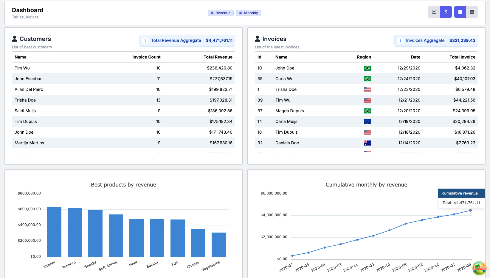
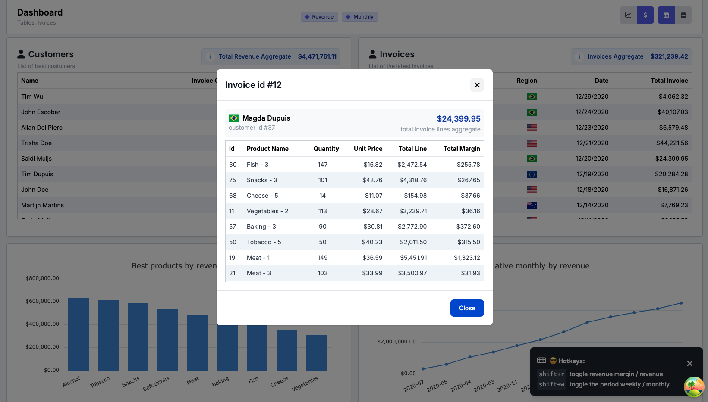
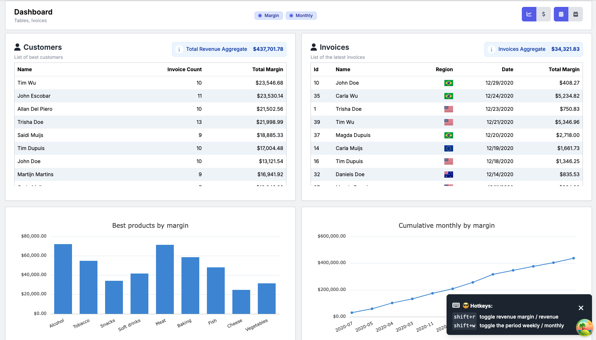

# Responsive dashboard with data display and hotkeys filtering

this project is a dashboard application using the following tech stack;
to run the project 

- react
- typescript
- tailwindcss +
- tanstack react query +
- ag-charts-react +
- react-flagkit +
- font-awesome icons +
- typescript
- build using vite

+ added to the original template

### Features

- responsive design
- state management using context api and react query
- quick filters
- custom hotkeys map allowing quick filtering
- aggregators for revenue sum and invoice sum
- bar chart
- line chart
- 100% type safe
- re-usable ui components (atoms)
- visual indicators (loaders)
- modal with backdrop using react portal
- data tables with sticky table headers
- offline indicator
- loading indicators or ghost placeholder loaders
- local storage persistance for application state
- currency and time formatting

## Preview

## Project architecture

this project is using components, react query and context api.
react-query manages the server state,
the small remaining portion of state to manage is filters
the filters are managed by context api and persistance in the localstorage.

### Folder structure
- componenent (ui components)
- hooks (shared hooks)
- contex (context api providers)
- api (queries and singleton instances)
  - queries
- const (project const)
- pages
- utils (shared utilities)

### Terminologies and file namings
to make sure files are easier to find, navigate and import
certain files have custom name extensions

*.query any query file
*.chart any chart file
*util.ts any file containing local module shared utility or common shared utility
*.spect.ts test files colocalted with the .ts files

- components are following pascal case
- folders small case
- utility files small case
- test files same as the colocated file

## Available Scripts

To install `pnpm` run `corepack enable`.

In the project directory, you can run:

### `pnpm dev`

Runs the app in the development mode server and client side application using `concurrently`

### `pnpm test`

Launches the test runner once

### `pnpm test:watch`

Launches the test runner in the interactive watch mode.

### `pnpm build`

Builds the app for production to the `dist` folder.

### `pnpm run server`

Runs the instance of `json-server` mocked REST API.
Once the API running, you'll be able to retrieve the assignment data set in order to focus only on the construction
of the front-end.

You can read more about [available routes for the API here](./server/ROUTES.md)

### `pnpm run check:format`

Runs `prettier` to check if code formatted accordingly.
